<p align="center">
  
</p>

<p align="center">
  <a href="https://github.com/ishandutta2007/Awesome-Awesome-Awesome"></a>
  <a href="https://discord.gg/jc4xtF58Ve"></a>
  <a href="https://github.com/ishandutta2007/Awesome-Heatmap-n-Session-Replay/stargazers"></a>
  <a href="https://github.com/ishandutta2007/Awesome-Heatmap-n-Session-Replay/network/members"></a>
  <a href="LICENSE"></a>
  <a href="#-how-to-contribute"></a>
  <a href="https://github.com/ishandutta2007"></a>
</p>

---

# 🚀 Awesome Heatmap &amp; Session Replay

> 🔍 **A Curated Directory of SaaS Platforms &amp; Open-Source Projects for User Behavior Visualization, Click/Scroll Heatmaps, Session Recording, DOM Replay, CRO, and UX Diagnostics.**

Whether you are optimizing conversion funnels, diagnosing rage clicks, resolving front-end bugs with devtools replay, or maintaining self-hosted data governance, this collection covers the entire landscape of **heatmaps** and **session replay**.

---

## 📑 Table of Contents

- [📊 Sector Market Dynamics](#-sector-market-dynamics)
- [🏢 SaaS / Hosted Platforms](#-saas--hosted-platforms)
- [⭐ Open-Source GitHub Projects](#-open-source-github-projects)
- [🧩 Key Architecture &amp; Ecosystem Capabilities](#-key-architecture--ecosystem-capabilities)
- [🤝 How to Contribute](#-how-to-contribute)
- [📈 Star History](#-star-history)
- [⚖️ Disclaimer &amp; Privacy](#️-disclaimer--privacy)

---

## 📊 Sector Market Dynamics

> 🌐 **Market Size & Structure**: The global Heatmap, Session Replay, and Digital Experience Analytics (DXA) market is estimated at **$2.8B – $3.5B+ (projected to reach $6B+ by 2030 at a ~16% CAGR)**. The sector is **moderately fragmented**—anchored by top enterprise DXA suites (Contentsquare, FullStory) and hyperscale cloud providers (Microsoft Clarity), alongside a highly competitive landscape of specialized SMB SaaS products and rapidly expanding open-source alternatives, rather than a single winner-take-all monopoly.

---

## 🏢 SaaS / Hosted Platforms

*Ranked and sorted descending by company scale, market capitalization, valuation, or estimated annual revenue.*

| 🏢 Platform | 📝 Description | 💰 Pricing (Starting Tier) | 🎁 Free Tier / Trial Limit | 📊 Company Size &amp; Valuation / Revenue |
| :--- | :--- | :--- | :--- | :--- |
| **[Microsoft Clarity](https://clarity.microsoft.com/)** | 🔍 Free behavior analytics &amp; session recording platform from Microsoft with unlimited sessions, rage-click detection, AI insights, and privacy-first masking. | **$0 / Free** (100% free tool, no paid tiers) | **Free forever plan**: Unlimited sessions, unlimited heatmaps, unlimited domains, 90-day recording retention | **~$3.1 Trillion** Parent Market Cap (Microsoft Corp.) |
| **[Smartlook](https://www.smartlook.com/)** | 📱 Qualitative analytics with session replay and heatmaps for web, iOS, and Android mobile apps, paired with funnel and retention tracking. | Starts at **$55/mo** (Business tier, billed monthly) | **Free forever plan**: Up to 3,000 sessions/month, 10 heatmaps, 10 events, 2 funnels, 1-month data history | **~$200 Billion** Parent Market Cap (Cisco Systems; acquired for ~$100M+) |
| **[Contentsquare](https://contentsquare.com/)** | 🌐 Enterprise digital experience analytics (DXA) platform featuring zone-based heatmaps, customer journey mapping, AI struggle detection, and impact quantification. | Starts at **$39/mo** (Growth plan, billed annually) / **$49/mo** (monthly) | **Free forever plan**: Up to 200,000 monthly sessions, 1 project, heatmaps, and funnels *(+ 15-day free trial on Growth tier)* | **$5.6 Billion** Valuation (Series F / ~$300M+ ARR) |
| **[Hotjar (Contentsquare)](https://www.hotjar.com/)** | 🎯 The industry standard for user feedback, visual heatmaps, rage clicks, and session recordings; now fully unified into the Contentsquare ecosystem. | Starts at **$39/mo** (Growth plan, billed annually) / **$49/mo** (monthly) | **Free forever plan**: Up to 200,000 monthly sessions, 1 project, heatmaps, and basic surveys (100 responses/mo) | **$5.6 Billion** Valuation (Acquired by Contentsquare; legacy ARR ~$40M+) |
| **[FullStory](https://www.fullstory.com/)** | ⚡ Enterprise digital experience intelligence platform offering pixel-perfect session replay, retroactive search, DX metrics, and AI-assisted friction analysis. | Starts at **~$10,000/yr** (~$833/mo) for Business tier / annual contract quote | **Free forever plan (FullstoryFree)**: 30,000 sessions/month, 10 seats, 1-year data retention *(+ 14-day free trial for premium)* | **$1.8 Billion** Valuation (Unicorn Series D / ~$100M+ ARR) |
| **[Glassbox](https://www.glassbox.com/)** | 🔒 Enterprise customer experience &amp; session replay platform built for regulated industries (banking, healthcare, insurance) with struggle detection and compliance archiving. | Starts at **$50,000/yr** (~$4,167/mo on AWS Marketplace / annual enterprise contract for up to 50K sessions/mo) | **30-day free trial**: Evaluation tier with full struggle detection, heatmaps, and session replay access | **~$150 Million** Valuation (Acquired by Alicia Tech / ~$50M+ ARR) |
| **[Crazy Egg](https://www.crazyegg.com/)** | 🍳 Classic heatmap tool offering click, scroll, and confetti maps along with simple A/B testing and snapshot visual reports. | Starts at **$29/mo** (Starter plan, billed annually at $348/yr) | **30-day free trial** on Starter plan: 5,000 tracked pageviews/mo, 5 heatmap reports, 50 session recordings/mo *(+ separate Free Web Analytics tier)* | **~$25 Million ARR** (Private / Bootstrapped SMB Leader) |
| **[Mouseflow](https://mouseflow.com/)** | 🖱️ Behavior analytics suite featuring 6 types of heatmaps (click, scroll, movement, attention, geo, live), friction scoring, and form drop-off analytics. | Starts at **$25/mo** (Essential plan, billed annually) / **$31/mo** (monthly) | **Free forever plan**: 500 recordings/sessions per month, 1 website, all 6 heatmap types | **~$20 Million ARR** (Midwest Nordic PE) |
| **[Lucky Orange](https://www.luckyorange.com/)** | 🍊 All-in-one CRO platform combining dynamic heatmaps, session recordings, live chat, conversion funnels, and checkout form analysis for ecommerce and SMBs. | Starts at **$32/mo** (Build plan, billed annually) / **$39/mo** (monthly) | **Free forever plan**: 100 sessions/month, heatmaps, and surveys *(+ 7-day free trial on higher tiers)* | **~$15 Million ARR** (The Riverside Company PE) |
| **[Inspectlet](https://www.inspectlet.com/)** | 🔬 High-precision session recording and eye-tracking/click heatmaps with JavaScript error logging and A/B testing suite. | Starts at **$39/mo** (Micro plan, 10,000 recorded sessions/mo) | **Free forever plan**: 2,500 recorded sessions/month, 3 websites, 1-month data retention | **~$8 Million ARR** (Bootstrapped / Private) |

---

## ⭐ Open-Source GitHub Projects

*Ranked and sorted descending by GitHub Star Count.*

| 📦 Project | ⭐ Github_Stars | 🛠️ Core Focus &amp; Capabilities | 📜 License |
| :--- | :--- | :--- | :--- |
| **[PostHog](https://github.com/PostHog/posthog)** | [](https://github.com/PostHog/posthog/stargazers) | 🦔 All-in-one product analytics suite: session replay, clickmaps/heatmaps, feature flags, A/B experiments, web analytics, and surveys. Self-hostable via Docker/K8s with ClickHouse backend. | `MIT / ELv2` |
| **[Umami](https://github.com/umami-software/umami)** | [](https://github.com/umami-software/umami/stargazers) | 🌿 Privacy-focused, lightweight, beautiful open-source web analytics solution with custom event tracking and real-time visitor insights. | `MIT` |
| **[Plausible Analytics](https://github.com/plausible/analytics)** | [](https://github.com/plausible/analytics/stargazers) | 📊 Lightweight, cookie-free, GDPR/CCPA compliant open-source website analytics tool built with Elixir and ClickHouse. | `AGPL-3.0` |
| **[Matomo](https://github.com/matomo-org/matomo)** | [](https://github.com/matomo-org/matomo/stargazers) | 🛡️ Leading self-hosted Google Analytics alternative with native Heatmaps &amp; Session Recording plugins, full data ownership, and enterprise privacy compliance. | `GPL-3.0` |
| **[OpenObserve](https://github.com/openobserve/openobserve)** | [](https://github.com/openobserve/openobserve/stargazers) | 🔭 Cloud-native observability platform built in Rust for logs, metrics, traces, and frontend session replay recording with massive compression. | `AGPL-3.0` |
| **[rrweb](https://github.com/rrweb-io/rrweb)** | [](https://github.com/rrweb-io/rrweb/stargazers) | 🎥 Foundational open-source DOM mutation recording and replay engine. Used as the core capture library across PostHog, OpenReplay, Highlight, and many custom internal tools. | `MIT` |
| **[OpenReplay](https://github.com/openreplay/openreplay)** | [](https://github.com/openreplay/openreplay/stargazers) | 🛠️ Developer-first session replay stack that pairs visual recordings with network payload inspect, Redux/Vuex state, console logs, and performance profiling. | `ELv2` |
| **[HyperDX](https://github.com/hyperdxio/hyperdx)** | [](https://github.com/hyperdxio/hyperdx/stargazers) | ⚡ Open-source telemetry platform built on OpenTelemetry (OTel) correlating browser session replay directly with backend distributed traces and logs. | `MIT` |
| **[Highlight](https://github.com/highlight/highlight)** | [](https://github.com/highlight/highlight/stargazers) | 💡 Full-stack monitoring platform combining session replay with front-end &amp; back-end error tracking and tracing for modern web applications. | `Apache-2.0` |
| **[Countly](https://github.com/countly/countly-server)** | [](https://github.com/countly/countly-server/stargazers) | 📱 Enterprise product analytics and mobile/web session analytics with rich plugin ecosystem and on-premise data control. | `AGPL-3.0` |
| **[Aptabase](https://github.com/aptabase/aptabase)** | [](https://github.com/aptabase/aptabase/stargazers) | 📱 Open-source, privacy-first mobile, desktop, and web product analytics with lightweight SDKs for React Native, Flutter, Swift, and Electron. | `AGPL-3.0` |
| **[rrHog](https://github.com/rrHog/rrHog)** | [](https://github.com/rrHog/rrHog/stargazers) | 🐗 Self-hosted web analytics and session recording stack leveraging rrweb capture paired with high-performance ClickHouse storage. | `MIT` |

---

## 🧩 Key Architecture &amp; Ecosystem Capabilities

```
┌────────────────────────────────────────────────────────────────────────┐
│                        User Browser / Mobile App                       │
└────────────────────────────────────────────────────────────────────────┘
       │                                              │
       ▼ (DOM Mutations & Mouse Events)               ▼ (Network & Console)
┌──────────────────────────────────────┐     ┌───────────────────────────┐
│     Capture Engine (e.g. rrweb)      │     │  Telemetry / Error Hooks  │
│  - DOM Snapshotting & Virtual Diff   │     │  - XHR / Fetch Payloads   │
│  - Canvas / WebGL Recording          │     │  - Console.log & Uncaught │
│  - Strict PII / Text Masking Engine  │     │  - Network Latency Traces │
└──────────────────────────────────────┘     └───────────────────────────┘
       │                                              │
       └──────────────────────┬───────────────────────┘
                              ▼
               ┌──────────────────────────────┐
               │    High-Throughput Ingestion │
               │   (Kafka / Vector / ClickHouse)│
               └──────────────────────────────┘
                              │
               ┌──────────────┴───────────────┐
               ▼                              ▼
┌──────────────────────────────┐ ┌──────────────────────────────────────┐
│       Visual Heatmaps        │ │        Session Replay Suite          │
│ - Click / Tap Coordinate Map │ │ - DOM Virtual Replayer with Canvas   │
│ - Scroll Depth & Attention   │ │ - DevTools Panel (Network/Console)   │
│ - Dead Clicks & Rage Clicks  │ │ - Timeline Frustration Event Markers │
└──────────────────────────────┘ └──────────────────────────────────────┘
```

### 💡 Selecting the Right Architecture

- **Full Product Analytics + Replay**: Choose **[PostHog](https://github.com/PostHog/posthog)** if you need an all-in-one product stack with feature flags, experiments, and funnel analysis.
- **Developer Debugging & Error Correlation**: Choose **[OpenReplay](https://github.com/openreplay/openreplay)** or **[Highlight](https://github.com/highlight/highlight)** for rich network payload inspection, Redux state inspection, and stack trace correlation.
- **Distributed Observability (OTel)**: Choose **[HyperDX](https://github.com/hyperdxio/hyperdx)** or **[OpenObserve](https://github.com/openobserve/openobserve)** to unify browser replays directly with backend distributed traces.
- **Custom Embedded Replay Tooling**: Use the foundational **[rrweb](https://github.com/rrweb-io/rrweb)** library to build proprietary internal inspection or customer support tooling.

---

## 🤝 How to Contribute

Contributions are warmly welcome! To add or update an entry:

1. 🍴 **Fork the repo** on GitHub.
2. 📝 **Add or edit entries** in [README.md](file:///C:/Users/hp/Documents/Projects/Awesome-Heatmap-n-Session-Replay/README.md) adhering to the existing table format.
3. 🔎 Ensure pricing, free tier limits, company sizes, and stargazer links are accurate and factual.
4. 🚀 **Submit a Pull Request** with a descriptive summary of your updates.

⭐ *Star the repo if you find it helpful for your UX research and behavior analytics stack!*

---

## 📈 Star History

[](https://star-history.dera.page/#ishandutta2007/Awesome-Heatmap-n-Session-Replay&type=date&legend=top-left)

---

## ⚖️ Disclaimer &amp; Privacy

- 📌 This repository is a **community-curated index** for informational and educational purposes.
- 🔒 **Privacy & Data Governance**: Session replay and heatmap technologies capture granular user interactions. Implementing organizations must ensure proper consent banners, PII data masking (passwords, credit cards, personal identifiers), and compliance with global privacy regulations including **GDPR, CCPA, and HIPAA**.
- ⚙️ **Self-Hosting Responsibility**: Self-hosted solutions require secure infrastructure, encryption at rest and in transit, and appropriate data retention schedules.

---

<p align="center">
  <b>Built for Product Managers, UX Researchers, Growth Engineers, and Developers building better user experiences.</b>
</p>
